# 🏛️ System Architecture Flowchart: People's Priorities

This document outlines the detailed operations, decisions, and data flows of the Constituency Development and Intelligence Platform.

---

## 🗺️ Mermaid Visual Flowchart

You can copy this Mermaid block directly into your pitch presentation slides or a Mermaid viewer:

```mermaid
flowchart TD
    %% Flowchart Nodes Style Definitions
    classDef terminal fill:#eff6ff,stroke:#2563eb,stroke-width:2px,rx:20px;
    classDef process fill:#f8fafc,stroke:#475569,stroke-width:1.5px;
    classDef decision fill:#fffbeb,stroke:#d97706,stroke-width:2px;
    classDef db fill:#ecfdf5,stroke:#059669,stroke-width:2px;
    classDef manual fill:#fff1f2,stroke:#e11d48,stroke-width:1.5px;

    %% 1. Input Phase (Terminals & Inputs)
    Start([Start: Citizen Suggestion Portal]):::terminal
    InputForm[/Citizen Fills Out Name & Suggestion Text/]:::process
    
    %% Micro recording decision
    MicCheck{Citizen Records Audio?}:::decision
    LocalRecord[\Local MediaRecorder Captures Raw .webm Chunk Stream\]:::process
    UploadStorage[Upload Binary Blob to Supabase Storage bucket]:::process
    DB_Storage[(Supabase Storage: voice-submissions & image-submissions)]:::db
    
    %% Photo check
    PhotoCheck{Citizen Uploads Photo?}:::decision
    UploadPhoto[\Select image file & upload to storage\]:::process
    
    %% GPS Verification
    GPSCheck{Citizen Checks Geolocation?}:::decision
    GPSLock[\HTML5 Geolocation locks GPS coordinates\]:::process
    
    FormSubmit[Click Submit Suggestion]:::process

    %% Relationships - Input Phase
    Start --> InputForm
    InputForm --> MicCheck
    MicCheck -- Yes --> LocalRecord --> UploadStorage --> DB_Storage
    MicCheck -- No --> PhotoCheck
    UploadStorage --> PhotoCheck
    
    PhotoCheck -- Yes --> UploadPhoto --> DB_Storage
    PhotoCheck -- No --> GPSCheck
    UploadPhoto --> GPSCheck
    
    GPSCheck -- Yes --> GPSLock --> FormSubmit
    GPSCheck -- No --> FormSubmit

    %% 2. Processing Phase (Rate Limiter, Sanitizer, Parser, Clusterer)
    Sanitizer[API Rate Limiter & XSS Sanitizer: Strips scripts & spam bursts]:::process
    GeminiParse[Gemini 2.5 Flash API: Multimodal Ingestion, Transcription, Translation & Category Mapping]:::process
    JaccardMatch{Jaccard Similarity De-duplication Check against existing data}:::decision
    IncrementCount[Increment Existing Cluster Vote Counts]:::process
    CreateNewNode[Create New demand_cluster node in database]:::process
    
    DB_Tables[(Supabase Tables: submissions, extracted_issues, demand_clusters, cluster_mappings)]:::db

    %% Relationships - Processing Phase
    FormSubmit --> Sanitizer
    Sanitizer --> GeminiParse
    GeminiParse --> JaccardMatch
    JaccardMatch -- Duplicate Found --> IncrementCount --> DB_Tables
    JaccardMatch -- Unique Entry --> CreateNewNode --> DB_Tables

    %% 3. Ingestion Routing & Verification (Human-in-the-loop decision)
    ConfidenceCheck{AI Confidence Score >= 70%?}:::decision
    QueueInsert[Insert into Review Queue: status = pending_review]:::process
    VerificationTab[Verification Queue: Tab 4 on MP Dashboard]:::manual
    VerifyClick[DPC Staff clicks Verify & Save]:::manual
    AutoVerify[Save as verified: status = verified]:::process

    %% Relationships - Routing
    DB_Tables --> ConfidenceCheck
    ConfidenceCheck -- No (< 70%) --> QueueInsert --> VerificationTab --> VerifyClick --> AutoVerify --> DB_Tables
    ConfidenceCheck -- Yes (>= 70%) --> AutoVerify

    %% 4. MP Planning & Budget Optimization (Solver Phase)
    DashboardLoad[MP Loads Planning Workspace]:::process
    WeightSliders[DPC adjusts priority sliders & sets budget cap limit]:::manual
    Solver[Dynamic Programming Knapsack Solver calculates funded portfolio]:::process
    FundedState{Is Project Funded within budget limits?}:::decision
    StateFunded[Set Scenario State: FUNDED]:::process
    StateDeferred[Set Scenario State: DEFERRED]:::process
    
    %% Approval Action
    MPApprove[MP clicks Approve on funded/deferred item]:::manual
    DB_Projects[(Supabase Tables: projects, decision_logs)]:::db
    AuditWrite[Write Immutable Transaction Audit Log]:::process
    End([End: Project Approved & Logged]):::terminal

    %% Relationships - Optimizer
    AutoVerify --> DashboardLoad
    DashboardLoad --> WeightSliders --> Solver --> FundedState
    FundedState -- Yes --> StateFunded --> MPApprove
    FundedState -- No --> StateDeferred --> MPApprove
    MPApprove --> AuditWrite --> DB_Projects --> End
```

---

## 🏛️ Symbolic Notations Explained

To help you present this chart to your teammate, here are what the different symbols (and CSS classes above) stand for:

| Flowchart Shape | Name | Purpose in this System |
| :--- | :--- | :--- |
| **Oval / Rounded Rectangle** | `Terminal` | Represents the entry point (Citizen portal form load) and the exit point (MP approval finalized). |
| **Parallelogram** | `Input / Output` | Represents data entry (User typing name, uploading files, or GPS coordinates). |
| **Rectangle** | `Process` | Represents automated backend actions (Rate limiting, sanitization, Gemini parsing, or Knapsack calculation). |
| **Diamond** | `Decision` | Represents logic forks (e.g. checks if user uploaded a file, checks if duplicate campaign matches Jaccard, or checks if AI confidence is low/high). |
| **Cylinder** | `Database` | Represents persistent storage (Supabase Storage buckets for raw voice notes and PostgreSQL relational tables). |
| **Red Rectangle** | `Manual Action` | Represents Human-in-the-loop actions (MP adjusting budget slides, verifying low-confidence suggestions, or clicking Approve). |
